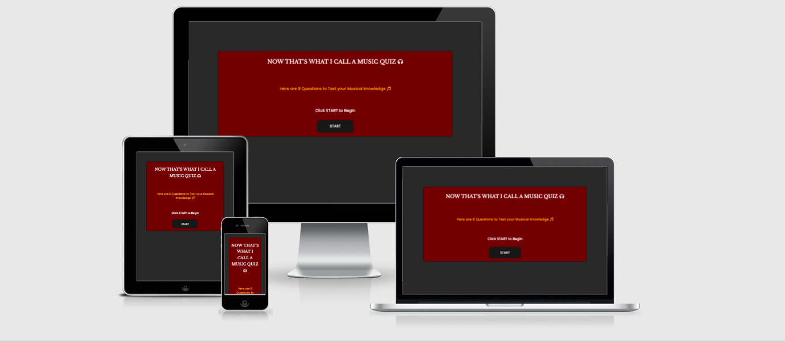
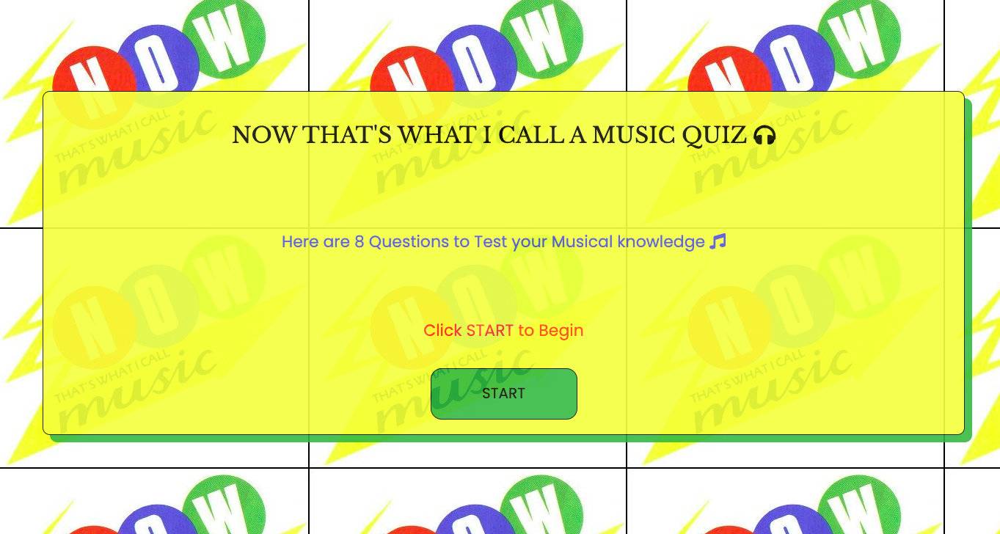
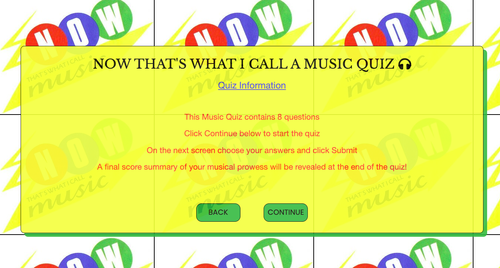
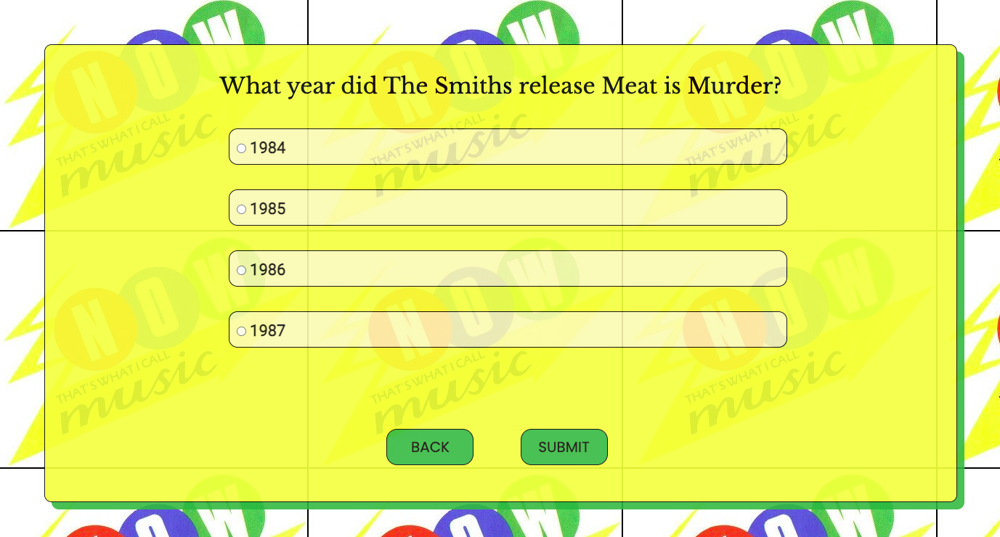
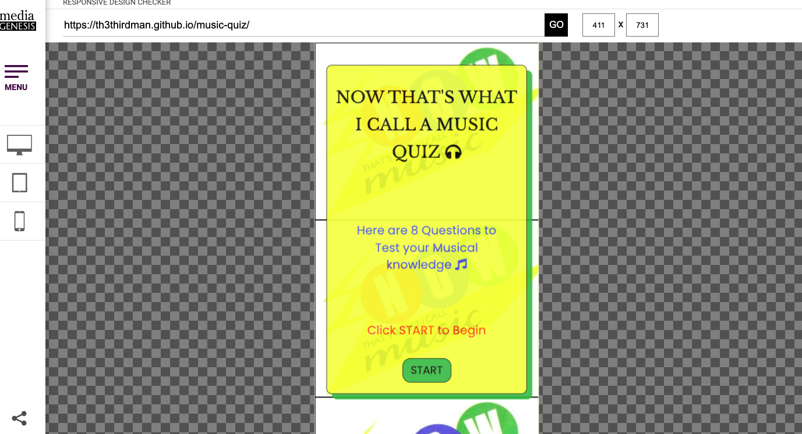
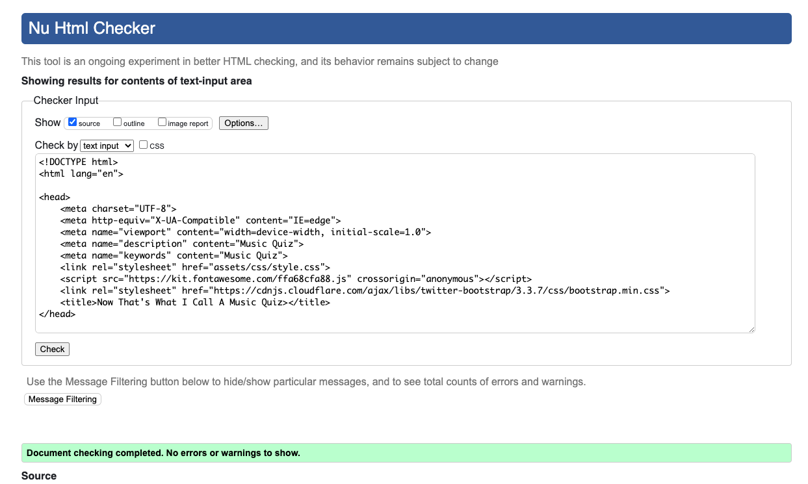
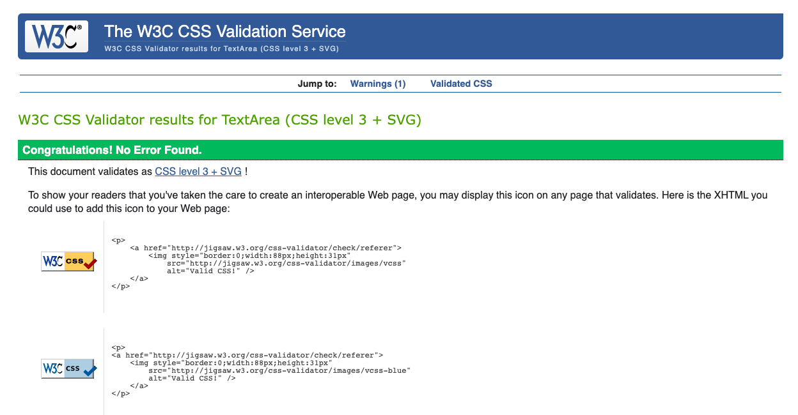
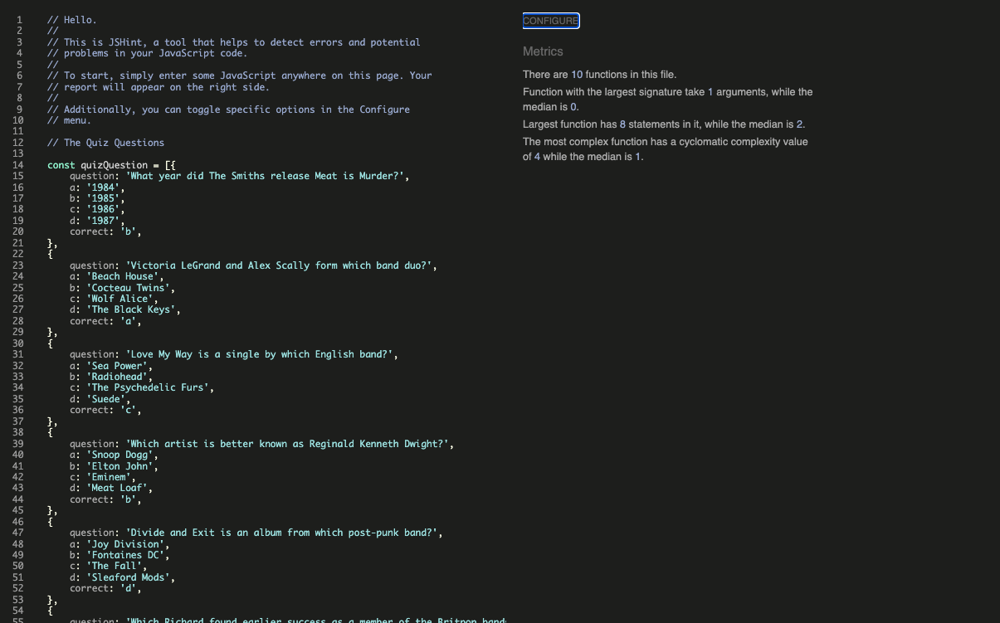
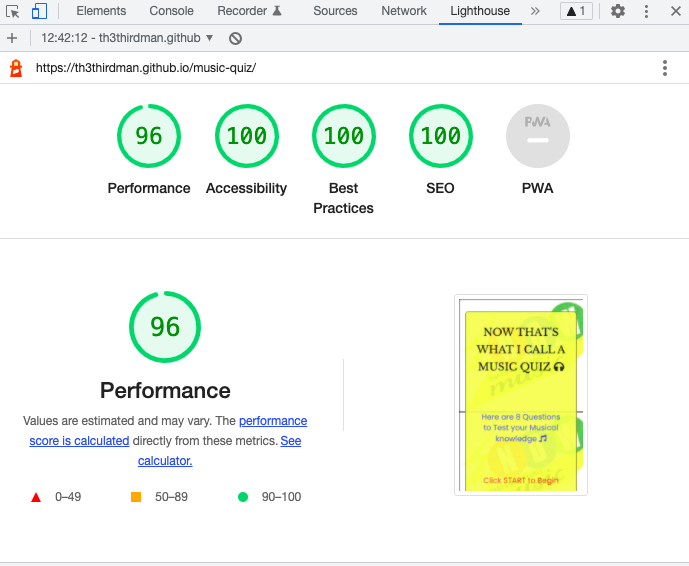

# Music Quiz

## Site Overview

The Now That's What I Call a Music Quiz is a parodic ode to the biggest selling album compilation brand in the world, which first came to light in the early 80s. The website is a quizzical resource created for those who enjoy music and the more kitsch elements this brand has continued to exhibit from the 80s to this current day. It is designed to test the musical knowledge of those who partake in the quiz, offering questions that span a number of decades.
  

It is a quiz designed to be interacted with by people of all ages and its use serves to provide a fun and brain-teasing experience for those who want to know if their knowledge is up to scratch musically. 
  

The Home page of the quiz is the primary source that reflects a strong and appealing visual of what the quiz is all about. The opening title highlights a relationship to music and references a well-known and loved brand in an anachronistic manner. Enthusiasts of the brand through all eras can relate to the slogan "Now That's What I Call Music!". This is emblazoned on the Home page in the form of a strong title. The background image is the official logo representation of NTWICM compilation albums from Now 3 through to Now 17, covering years 1984 to 1990. 

The Information page gives simple instructions on how to complete the quiz and what the user will come to expect. On the Information page it indicates there are 8 questions available for users to attempt. It shows instructions on how to get to the quiz, how to submit answers, and how many correct questions will be totted up upon conclusion of the quiz.
  

 

# Planning Stage
 

## Identifying a Target Audience
 

* People who enjoy music.

* People who are interested in finding out more about various artists and musicians that are referenced in the quiz.

* People who have a penchant for taking part in quizzes, testing themselves on music from different eras.

  

# User Stories
 

## First-time Visitors

* Users should want to have immediate information on the subject matter of the website.

* The site should have the ability to be easily navigable for visitors to get started in using the quiz.

* The site should provide inspiration for a visitor who is interested in all things related to music.

 

## Returning Visitors

* For returning visitors it would be good to have a larger bank of questions for a user to test themselves.

* For returning visitors an indicator of correct and incorrect answers during the quiz would be helpful.

 

 

# Design

 

## Colour Schemes

 

* For the colour schema of the website I initially drew from a personal aesthetic that I felt could work well as a quiz. I mixed and matched colours that I felt coincided well off the palette but as the project was partially based on a theme I decided to go with colours that complimented the thematic background image. To mirror the retro colourway of the other elements on the site I used Pixlr to grab the original logo colours. This worked well and gave the quiz a more vibrant and fun feel, which is the desired effect of a quiz endeavour. The primary trio of colours were as follows: #fcff4a, #4f61d5, #61b03f.

* In addition to the 3 colours dedicated to the entirety of the quiz pages a rgb(253, 246, 180) was utilised as a background colour in the quiz section. A white background did initially suffice here but I felt it needed more refining. This colour worked better when dropped behind the yellow quiz box.

* Hover options on buttons employed the primary colours set for the project, specifically matched to the NTWICM logo.

 

## Font Families

 

* Font Families included Libre Baskerville, Poppins, and Roboto for the Body. I felt that Libre Baskerville (not excluding its excellent name) complimented the quiz, It added a clarity and refinedness that the pages deserved. 

* Roboto was utilised for text information in the Walks page. This went well with the lightness in attitude of what is expected in a quiz. 

  

# Features

 

## The Start Page

 

  * The Start Page consists of the NTWICM logo set as a background with a simple box outlining the nature of the site, how many questions are to be answered, and the means to progress on through to the quiz. 

  * An opacity element was integrated into the inner box feature allowing more transparency to view the background.

   

   

   

  ## The Information Page

   

  * The Information Page consists of the primary details and instructions on how to take part in the quiz.

  * The only interactive parts on this page are the buttons which allow users to advance or return to the Start page.

   

  

   

  ## The Questions Page

   

  * The Questions Page is where a bank of 8 questions on music are compiled and rendered.

  * Interactive parts come in the form of radio buttons where an answer can be selected, and again, through Back and Submit buttons, allowing a user to return back to the Information or Start page or submit an answer to the quiz.

   

  

    

  # Testing

  * The project was tested rigorously in a responsive manner, particularly for rendering on smaller and mobile devices. Devices used were: Mobile (Xiaomi Mi 10, 6"), Tablet (Samsung, 7.5" & iPad Air, 8"), Laptop (MacBook Air, 13"). 

  * The site was tested on different browsers, Chrome, Safari and Firefox.

   

  # Responsiveness

  

   

  * The responsiveness of the site was ran through [Responsive Design Checker](https://responsivedesignchecker.com/) and rendered well on all mobile devices during testing.

   

  # Validation

  * No errors were recorded when entered into the official W3C Validator for HTML.

   

  

  * No errors were recorded when entered into the official W3C Validator for CSS.

   

  

  * No errors were recorded when entered into JSHint.

   

  

    

  # Web Developer Tools
  
   
  
  ## Lighthouse

   

   

    

  # Future Features

  * Add a question counter to denote to the user how far along in the quiz they are.

  * Include a feature that highlights correct or incorrect answers.

  * Exclude the use of radio buttons for alternatives that allow a user to click just the answer box.

    

  # Bugs

   

  * I encountered a few issues where the site didn't meet my intended expectations. This primarily resided in the arena of responsiveness when viewing the screen at mobile level. The quiz didn't render seamlessly in a landscape view. A fix for this was to dispense with static height and width properties that were yielding limitations when added to the body.

  * Much to my chagrin, the project's quiz page featured radio buttons which wouldn't have been an initial preference for inclusion. They work as designed, but limitations in time and JavaScript learning prevented a nicer styling method whereby a user can submit answers. It wasn't necessarily a bug but I attempted many workarounds to diminish or hide their presence as I felt that they didn't quite suit the aesthetic of the quiz that I was hoping to make.

  * For the interactive parts of the project I encountered some difficulty with JavaScript, primarily with the quiz page. The scores for the quiz didn't add up correctly, but I discovered that the reason for this inaccuracy was down to syntax errors when writing up the quiz questions. Correcting the amount of commas alleviated this problem.

    

  # Unfixed Bugs

   

  * There were no unfixed bugs.

    

  # Deployment

   

  * The website was deployed to GitHub Pages in the following manner:

    * From the project's [Repository](https://github.com/Th3ThirdMan/music-quiz) go to Settings:
    * Scroll down to GitHub Pages
    * Select Branch, Main & Save.
    * A message will indicate that the project has been successfully deployed here and a live link is available.

     

    You can find the live site here: [Music Quiz](https://th3thirdman.github.io/music-quiz/)

      

    ## Content & Media

     

    The content and media used during the project was sourced and referenced as follows:

     

     * Photo Editor [Pixlr](https://pixlr.com/x/#home)
     * Knowledge Base [W3Schools](https://www.w3schools.com/)
     * Responsive Aid [AmIResponsive](http://ami.responsivedesign.is/)
     * Build a Quiz App with JavaScript [YouTube](https://www.youtube.com/watch?v=riDzcEQbX6k)
     * Create a Quiz App Using HTML, CSS & JavaScript [YouTube](https://www.youtube.com/watch?v=CqddbIrEM5I)
     * Social Media Icons [Font Awesome](https://fontawesome.com/)
     * Fonts [Google Fonts](https://fonts.google.com/)
     * Responsive Design [Responsivedesignchecker](https://responsivedesignchecker.com/)