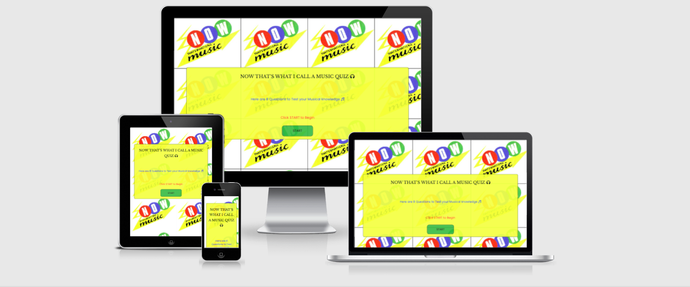

# Music Quiz

## Site Overview

The Now That's What I Call a Music Quiz is a parodic ode to the biggest selling album compilation brand in the world, which first came to light in the early 80s. The website is a quizzical resource created for those who enjoy music and the more kitsch elements this brand has continued to exhibit from the 80s to this current day. It is designed to test the musical knowledge of those who partake in the quiz, offering questions that span a number of decades.
  

It is a quiz designed to be interacted with by people of all ages and its use serves to provide a fun and brain-teasing experience for those who want to know if their knowledge is up to scratch musically. 
  

The Home page of the quiz is the primary source that reflects a strong and appealing visual of what the quiz is all about. The opening title highlights a relationship to music and references a well-known and loved brand in an anachronistic manner. Enthusiasts of the brand through all eras can relate to the slogan "Now That's What I Call Music!". This is emblazoned on the Home page as a strong title. The background image is the official logo representation of NTWICM compilation albums from Now 3 through to Now 17, covering 1984 to 1990. 

The Information page gives simple instructions on how to complete the quiz and what the user will come to expect. On the Information page it indicates there are 8 questions available for users to attempt. It shows instructions on how to get to the quiz, how to submit answers, and how many questions will be totted up correctly upon conclusion of the quiz.
  

 

# Planning Stage
 

## Identifying a Target Audience
 

* People who enjoy music.

* People who are interested in finding out more about various artists and musicians that are referenced in the quiz.

* People who have a penchant for taking part in quizzes, testing themselves on music from different eras.

  

# User Stories
 

## First-time Visitors

* Users should want to have immediate information on the subject matter of the website.

* The site should have the ability to be easily navigable for visitors to get started in using the quiz.

* The site should provide inspiration for a visitor who is interested in all things related to music.

 

## Returning Visitors

* For returning visitors it would be good to have a larger bank of questions for a user to test themselves.

* For returning visitors an indicator of correct and incorrect answers during the quiz would be helpful.

 

 

# Design

 

## Colour Schemes

 

* For the colour schema of the website I initially drew from a personal aesthetic that I felt could work well as a quiz. I mixed and matched colours that I felt coincided well off the palette but as the project was partially based on a theme I decided to go with colours that complimented the thematic background image. To mirror the retro colourway of the other elements on the site I used Pixlr to grab the original logo colours. This worked well and gave the quiz a more vibrant and fun feel, which is the desired effect of a quiz endeavour. The primary trio of colours were as follows: #fcff4a, #4f61d5, #61b03f.

* Navbar links and Heading text in the Home page were offered the unadventurous, but stellar rgb(255, 255, 255). This worked well and in keeping with a simple and understated look, but nonetheless, a classic design.

* Hover options on navigation links and social media icons yielded a rgb(245, 73, 6) for good contrast.

 

## Font Families

 

* Font Families included Libre Baskerville, Poppins & Roboto for the Body. I felt that Libre Baskerville (not excluding its excellent name) complimented the quiz , especially for navigation links and welcome text. It added a clarity and refinedness that the pages deserved. 

* Roboto was utilised for text information in the Walks page. This went well with the lightness in attitude of the Walks page. Roboto added to those descriptions, also complimenting the character of the Walks descriptions.

  

# Features

 

## Navigation

 

   * The Navigation Bar is featured on all 4 pages of the website.

   * The top left-hand side of the page features the website Name: Dublin City Walks. There is no active link attached to this logo.

   * Active navigation links reside to the top right-hand side of the page. They are as follows: Home, Walks, Gallery, Contact. These link to 3 further separate pages in the website.

   * The links created give a good overview of what the website is conveying and creates a simplistic, clean view of how one should navigate the site. 

   * Prevailing colours for the Navigation bar were designed in a contrasting black and white *(Figure 1.1)*

   * A hover red option with a text decoration underline is present on all Navigation links on all pages *(Figure 1.2)*  

   * A hamburger menu was initially entertained and created, but the inclusion of JavaScript felt it wouldn't be within the remit of Portfolio requirements. This could be an option for later Portfolio submissions.

  

   
   *Figure 1.1*
     

   
   *Figure 1.2*

  

## The Start Page

 

  * The Home Page consists of the quintessentially unmistakeable backdrop of an iconic landmark in that of the H'apenny Bridge. Plenty of feet have tread this bridge for centuries so it felt appropriate to make this a centrepoint image on the landing page.

  * The logo sentiment is reiterated and also an added textual sentiment is present to indicate that Dublin is an exciting city that is built for walking.

  * The image adopts a transform and zoom element which gives depth upon opening the page. 

  * The smaller images coupled with text give more than just a visual representation, plus it gives a taste of the history of Dublin when people partake in walks around the city.

   

   
  *Figure 1.3*

   

  ## The Information Page

   

  * The Walks Page consists of a primary 40em image with an eye-catching text description of the best walks available to anyone who visits the site.

  * There is a varied amount of imagery depicting the landscape, but there is context to each location drawing from Irish literature to scenic vistas. This gives the reader a sense of not only the prospect of a nice walk, but an historical outlay of what's worth visiting in Dublin. 

  * Links at the base of the page give the visitor an option to visit the Gallery or Contact Page.

    

  ## The Questions Page

   

  * 

  * 

    

  # Testing

  * The project was tested rigorously in a responsive manner, particularly for rendering on smaller and mobile devices. Devices used were: Mobile (Xiaomi Mi 10, 6"), Tablet (Samsung, 7.5" & iPad Air, 8"), Laptop (MacBook Air, 13"). 

  * The site was tested on different browsers, Chrome, Safari and Firefox.

   

  # Validation

  * No errors were recorded when entered into the official W3C Validator for HTML.

   

  

  * No errors were recorded when entered into the official W3C Validator for CSS.

   

  

  * No errors were recorded when entered into the official W3C Validator for JavaScript.

   

  # Web Developer Tools
  
   
  
  ## Lighthouse

   

   

    

  # Future Features

  * Add a question counter to denote to the user how far along in the quiz they are.

  * Include a feature that highlights correct or incorrect answers.

  * Exclude the use of radio buttons for alternatives that allow a user to click just the answer box.

    

  # Bugs

   

  * I encountered a few issues where the site didn't meet my intended expectations. This primarily resided in the arena of responsiveness when viewing the screen at mobile level. The navigation bar was reflected as a desktop view when rendered down to a mobile screen. A fix for this was to employ the flex property to adjust this issue and view the website in a proper mobile aspect.

  * I encountered issues with the sub-images and text on the landing page. A container class worked well here with the images and text, assuming an equality to both, which helped when viewing on lower height and width screens.

  * Again with the sub-images on the Welcome page the images didn't align correctly as per my expectation, but through testing and research the background-size property played a part in correcting this.

    

  # Unfixed Bugs

   

  * There were no unfixed bugs.

    

  # Deployment

   

  * The website was deployed to GitHub Pages in the following manner:

    * From the project's [Repository](https://github.com/Th3ThirdMan/music-quiz) go to Settings:
    * Scroll down to GitHub Pages
    * Select Branch, Main & Save.
    * A message will indicate that the project has been successfully deployed here and a live link is available.

     

    You can find the live site here: [Music Quiz](https://th3thirdman.github.io/music-quiz/)

      

    ## Content & Media

     

    The content and media used during the project was sourced and referenced as follows:

     
    
     * Photo Editor [Pixlr](https://pixlr.com/x/#home)
     * Knowledge Base [W3Schools](https://www.w3schools.com/)
     * Responsive Aid [AmIResponsive](http://ami.responsivedesign.is/)
     * Build a Quiz App with JavaScript [YouTube](https://www.youtube.com/watch?v=riDzcEQbX6k)
     * Create a Quiz App Using HTML, CSS & JavaScript [YouTube](https://www.youtube.com/watch?v=CqddbIrEM5I)
     * Social Media Icons [Font Awesome](https://fontawesome.com/)
     * Fonts [Google Fonts](https://fonts.google.com/)